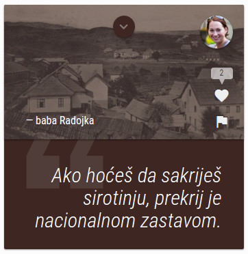
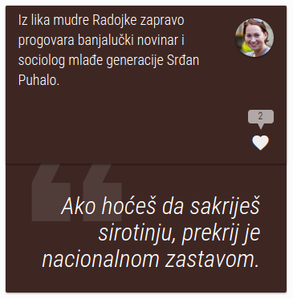
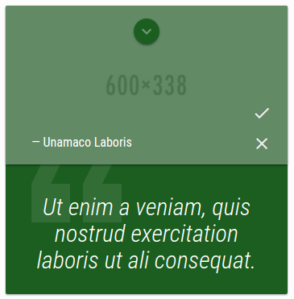

# 1. Uvod
## 1.1 Korišćeni programski jezici
Dinamički web site QuoteApp je napisan u serverskom jeziku PHP, u framework-u Codeigniter, a od klijentrskih jezika korišćen je JavaScript u obliku AJAX-a i biblioteke jQuery. Markup jezik je HTML, uz dodatak lično kreiranih atributa u obliku ```data-[atribut]```, za potrebe dohvatanja podataka iz DOM-a preko jQuery selektora. Za stilizovanje je korišćen CSS3 , u obliku novijih tehnika stilizovanja i animacije. Dizajn sajta je osmišljen prema osnovnim standardima Material Design stila od Google-a, a koriščen je Material Design Icon font za ikonice. Inicijalno je upotrebljena tema Bootstrap.
## 1.2 Opis funkcionalnosti
QuoteApp je zamišljen kao rudimentarna društvena mreža, gde bi svaki korisnik kreirao profil, a za početak imao mogućnost učestvovanja u dinamičkom kreiranju sadržaja sajta, u okvirima predviđenog. Korisnici smišljaju kartice na kojima su odabrani citati njima poznatih osoba, a inače anonimnih ljudi. To mogu biti članovi porodice, slučajni prolaznici ili članovi lokalnih zajednica, ali nikako poznati pisci, glumci, političari... Osim citata, korisnici imaju prilku da saopšte ime autora citata, dodaju sliku na karticu i napišu kratak bliži opis osobe ili prilike, a takođe i odaberu boju svoje kartice, od nekoliko ponuđenih.

QuoteApp sadrži dinačko prikazivanje kartica iz baze, na početnoj stranici, kao i na stranicama profila svih korisnika, a svaka kartica kao gradivna jedinica sastoji se iz podataka koji čine nju samu, kao i podataka o njenom autoru. A u bazi se čuvaju i podaci o lajkovima, flegovima, kao i manipulaciji administratora nad karticom, ukoliko do toga dođe akcijom korisnika.

Administratorski panel, osim o flegovanim karticama, sadrži i dinamičke podatke o banovanim korisnicima, a administrator je u mogućnosti da jednim klikom upravlja i korisnicima i karticama. Ovde je korišćen AJAX.

Registrovani korisnici kreiraju kartice. Svoje mogu da obrišu, a tuđe mogu da lajkuju ukoliko im se dopadaju, ili fleguju (prijave administratoru), ukoliko ocene sadržaj kao nepodoban, a za realizaciju ovih funkcionalnosti sam koristila AJAX.

Posledica kreiranja nepodobnog sadržaja je banovanje, što zavisi od arbitraže administratora. Banovan korisnik se ne može ulogovati na sajt, sve dok mu to ponovo ne omogući administrator.

*Sopstvena kartica koju je moguće izbrisati:*


* Tuđa kartica koju je moguće lajkovati ili flegovati, ali na drugoj slici prikazana onako kako je vidi neautorizovani korisnik i to nakon animacije na klik:



* Flegovana kartica kako je vidi administrator u svom panelu:



Unutar footer-a se nalazi dinamički meni sa leve strane, koji se sastoji iz linkova ka društvenim mrežama, a prikazan je u vidu odgovarajućih ikonica.
## 1.3 Template
Sama sam kreirala strukturu sajta, ne postoji tuđi templejt.
## 1.4 Korišćeni CSS
Bootstrap CSS framework je korišćen mahom u svrhu responsivnosti, dok je sve ostalo restilizovano.