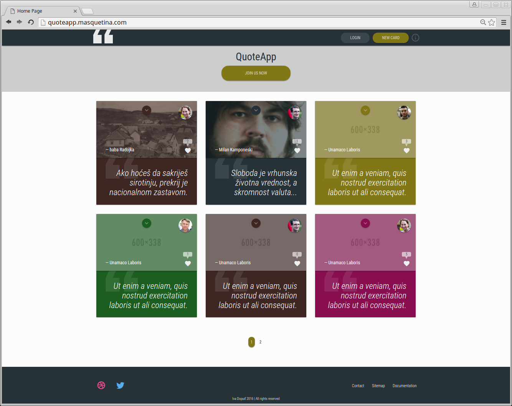
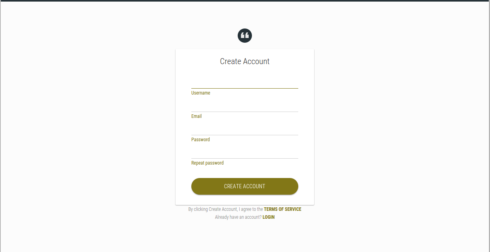
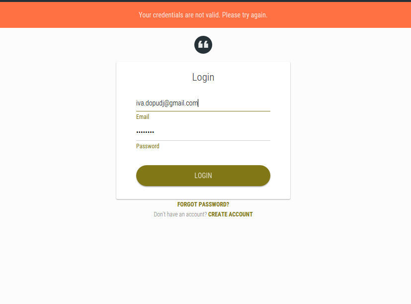
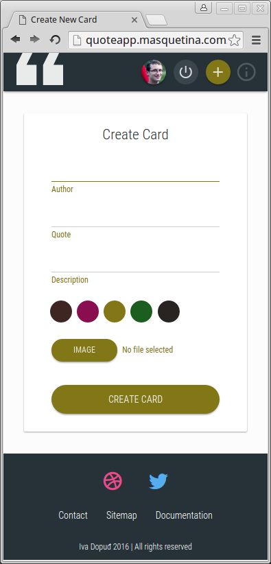
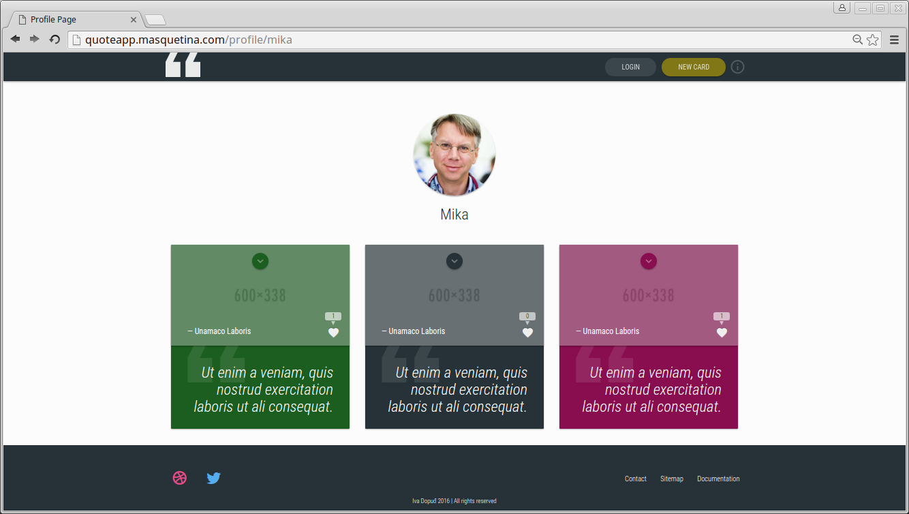

# Vodič kroz aplikaciju
Početna stranica QuoteApp inicijalno prikazuje sve kreirane kartice kojima je marker delete jednak 0, dinamički izlistane iz baze, svih postojećih korisnika, sortirane od najnovije, ka starijim.

U zaglavlju se nalazi fiksirani meni, koji prikazuje odgovarajuće linkove u odnosu na to da li je korisnik ulogovan, i ako jeste, koja mu je usloga dodeljena.

Klikom na ikonicu "i" sa desne strane otvara se modal koji pruža informacije o autoru, a dostupan je svim korisnicima, bez obzira na status i ulogu.

Život korisnika na QuoteApp nastavlja se pravljenjem korisničkog naloga. Na stranicu predviđenu za ovu svrhu stiže se klikom na dugme JOIN US NOW, i ono je dostupno neautorizovanim korisnicima na početnoj stranici sajta, (ali i kao dodatni link na stranici za logovanje). Stranica za kreiranje korisničkog naloga se sastoji iz zaglavlja, centralnog dela sa dva dodatna linka u dnu, i podnožja stranice.

Zaglavlje je vidljivo korisniku samo u svrhu prikazivanja flashmessage, ukoliko ona postoji, (ovo je zajedničko za sve stranice na kojima se nalazi forma), a u dnu su linkovi ka Terms of service, koji otvara modal i link ka LOGIN stranici ukoliko ovaj korisnik već ima kreiran nalog.

U centralnom delu se nalazi forma u koju korisnik upisuje svoje podatke. Obradu podataka sam uradila pomoću biblioteke form_validation, koja je učitana u konfiguracionom fajlu autoload. Ispis grešaka je ispod svakog polja ponaosob, i adekvatno je stilizovan. Nakon ispravno unesenih podataka, klikom na dugme CREATE ACCOUNT, kreira se korisnički nalog u bazi, i korisnik biva redirektovan na stranicu za logovanje, uz adekvatnu propratnu flashmessage. Takođe, svakom korisniku biva dodeljana podrazumevana profilna slika, koju kasnije mogu promeniti na stranici svog profila.

Na stranici za logovanje se nalazi forma za upis korisničkog imena i lozinke. Ovde nisam iskoristila biblioteku form_validation, već se jednostavno, ukoliko korisnik ne postoji u bazi, ispisuje flashmessage koja upozorava na to.

Ukoliko je logovanje uspešno, korisnik biva redirektovan na početnu stranicu, uz dodatne izmene u odnosu na ono kako ju je video kao neautorizovan. Dugme JOIN US NOW se više ne prikazuje, a umesto dugmeta LOGIN se prikazuje dugme LOGOUT. Takođe, dugme NEW CARD dobija svoju svrsishodnost, odnosno, klikom na njega korisnik stiže na stranicu na kojoj je u mogućnosti da kreira novu karticu, a koja mu je dok je bio neautorizovan bila nedostupna.

Dodatne promene na početnoj stranici koje se tiču statusa autorizovanog korisnika su i te da može da lajkuje i fleguje tuđe kartice, a svoje da obriše, ukoliko to želi. Kao neautorizovan je mogao samo da vidi broj lajkova, a ostale funkcije koje sam nabrojala su mu bile nedostupne. Takođe, pored dugmeta LOGOUT, autorizovani korisnik vidi i svoju profilnu sliku.

U dnu početne stranice, iznad podnožja, nalaze se linkovi za straničenje, koji su podjednako klikabilni za neautorizovane, kao i za autorizovane korisnike, a realizovani su pomoću biblioteke pagination.

Forma za kreiranje nove kartice je urađena uz mnogo jQuery koda, koji pre svega proverava unos korisnika i ispisuje greške, ali i učestvuje u stilizovanju input[type=file], čiji sam podrazumevani izgled potpuno promenila i vizuelno prilagodila stilu sajta.

 

Nakon kreiranja kartice, korisnik je redirektovan na stranicu svog profila, gde može da je vidi, kao i sve ostale svoje kartice, poređane od najnovije ka starijim.

Osim svog profila, korisnik klikom na profilnu sliku drugog korisnika, koja se nalazi na svakoj od kartica čiji je ovaj autor, može da stigne na profilnu stranicu tog korisnika.

Administrator je posebna vrsta autorizovanog korisnika. On nema svoju profilnu stranicu, jer mu nije ni potrebna, niti učestvuje u kreiranju, lajkovanju i/ili flegovanju kartica, jer to nije njegova uloga. On je zadužen za upravljanje već kreiranim karticama i korisnicima. Naime, može se desiti da je neka kartica neprikladnog sadržaja i tada biva flegovana od strane nekog korisnika. Takve kartice su vidljive administratoru u okviru administratorskog panela, i on je dužan da ih dalje procesuira. On karticu može označiti kao neadekvatnu i time je potpuno ukloniti sa sajta, a autora kartice banovati, a može karticu oceniti kao adekviatnu i time joj flag marker vratiti na 0. Ako je neki korisnik banovan, prikazan je na kartici u administratorskom panelu, gde se vidi njegova profilna slika, korisničko ime i datum banovanja. Administrator može vratiti marker ban na 0, klikom na ikonicu X na kartici korisnika. Ukoliko je korisnik banovan, nije u mogućnosti da se uloguje, pa mu funkcionalnosti za autorizovane korisnike sajta samim tim nisu dostupne, a pri pokušaju logovanje na to je upozoren putem ispisa flashmessage.

Funkcionalnosti lajkovanja, flegovanja i brisanja kartice od strane korisnika su realizovane upotrebom AJAX-a, a takođe i sve radnje u okviru administratorskog panela. Ovde bih posebno istakla momenat ocenjivanja kartice kao neadekvatne i banovanja korisnika, gde se AJAX-om šalju podaci o kartici, a vraćaju podaci o korisniku da bi se on istovremeno ubacio na listu banovanih. Naime, DOM ne prepoznaje sadržaj ovako ubačen, iako ga administrator vidi!

JavaScript kod koji se nalazi u okviru stranica VIEW-а sam kompletno pisala sama, ali modali pripadaju Bootstrap temi, i taj kod se nalazi u ../vendor/js/bootstrap.js.

Sve forme su kreirane pomoću form helpera.

Css je inicijalno Bootstrap, ali sam ga restilizovala da odgovara smernicama Material Design stila. Animaciju na karticama sam uradila samostalno. Koristila sam CSS3 maksimalno, a takođe i Icon font MDI. Logo i ilustracija na početnoj stranici su u formatu SVG, radi kvalitetnijeg prikaza na uređajima visoke rezolucije. U HTMl-u sam iskoristila mogućnost definisanja sopstvenih atributa unutar tagova, u obliku data-[ime], da bih podatke lakše dohvatala pomoću jQuery biblioteke.

Sajt je kompletno responive, a na malim ekranima tekst u navigacionom meniju zamenuju odgovarajuće ikonice.

Napomenula bih još, da je ovo tek prvi draft ili skica sajta, koja jeste funkcionalna, ali po mom mišljenju daleko od svog maksimuma. Posebno bih se osvrnula na JavaScript kod koji je razbacan i potrebna mu je refaktorizacija, jer se dobar deo ponavlja iz stranice u stranicu, i osim premeštanja u eksterni js fajl, bilo bi poželjno iz postojećeg koda izdvojiti zajedničke funkcije kojima mi bi se samo prosleđivali različiti parametri, umesto ponavljanja istog koda. Takođe, svesna sam da je svaku formu na sajtu potrebno, u smislu validacije unesenih podataka, tretirati na isti način, iako sam ja u ovoj verziji za različite forme uradila različite validacije. To sam uradila za sada ovako, da bi svaki od načina bio zastupljen, odnosno da bih pokazala da znam da uradim svaki način, a u konačnom obliku, trebalo bi ih kombinovati, odnosno za svaku formu uraditi prvo proveru sa klijentske strane, pa proveru sa serverske strane, i napokon uporednu proveru podataka koje vraća baza.

